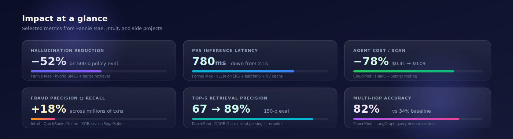
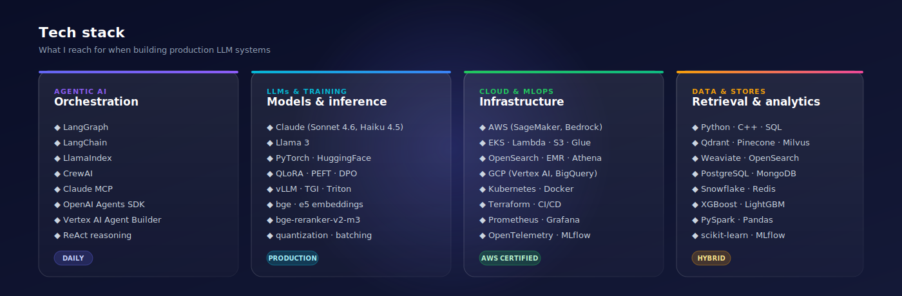

<!-- ━━━━━━━━━━━━━━━━━━━━━━━━━━━━━━━━━━━━━━━━━━━━━━━━━━━━━━━━━━━━━━━━━━━━━━━━━━ -->
<!--                       rakulav / rakulav · profile README                   -->
<!-- ━━━━━━━━━━━━━━━━━━━━━━━━━━━━━━━━━━━━━━━━━━━━━━━━━━━━━━━━━━━━━━━━━━━━━━━━━━ -->

<div align="center">



<br/><br/>

<a href="https://www.linkedin.com/in/rakulav-01/"></a>
<a href="mailto:rakulav26@gmail.com"></a>


</div>

<br/>

## About

I'm an **AI Engineer with 5+ years** building generative AI and agentic systems for workflows where a hallucination has a dollar cost. Most of my time goes to the unglamorous parts of the LLM stack: retrieval that won't invent policy numbers, eval harnesses that gate every rollout, inference paths that turn a 2.1s p95 into 780ms without changing the model, and agents that know when to route decisions to a human.

Recent work spans a **LangGraph mortgage-risk agent at Fannie Mae** over a governed policy corpus, a **fraud detection pipeline for QuickBooks Online at Intuit** serving millions of users on SageMaker, and a multi-agent fraud investigation system with calibrated verdicts and human-in-the-loop approval gates.

I care about retrieval that abstains, evals that gate, inference that's cheap, agents that don't lose the plot at 5K items of context, and high-recall systems that respect the analyst's time.

<br/>

## Impact at a glance



<br/>

## Featured systems

> Each of these solves a problem that doesn't show up in vendor demos.

<br/>

<table>
<tr>
<td width="50%" valign="top">

### 🛰️ CloudPilot
**Autonomous cloud engineer**

A LangGraph agent that scans an AWS account, reasons about misconfigurations across 14 resource types, and proposes least-privilege fixes. The interesting problems were **working memory at scale** and **cost of reasoning**.

**Highlights**

- **Streaming working memory in Qdrant** keeps the agent coherent at 5K+ resources per scan inside a 200K-token budget. Naive approaches overflow at ~800.
- **Two-stage model router.** Haiku 4.5 classifies findings on severity × confidence; only low-confidence cases escalate to Sonnet 4.6. **94% agreement** with a Sonnet-only baseline on a 200-scan eval.
- **Runtime IAM synthesis** via STS AssumeRole. Every proposed fix gets its own least-privilege, action-scoped role. No ambient admin creds.
- **60-second undo window** backed by a state-diff rollback engine that snapshots to Postgres.

```
cost / scan      $0.41  →  $0.09    ▼ 78%
scale            5K+ resources, 200K tok budget
agreement        94% vs Sonnet-only baseline
rollback         60s undo on reversible actions
```

`LangGraph` · `Claude MCP` · `boto3` · `Qdrant` · `FastAPI` · `Postgres` · `Next.js`

</td>
<td width="50%" valign="top">

### 📚 PaperMind
**Personal AI research analyst**

Retrieval over 340 ML papers that knows when not to answer. Built after getting frustrated with RAG demos that confidently cite nonexistent sections.

**Highlights**

- **GROBID structural parsing** instead of token-count chunking. Sections, equations, and tables stay intact. Top-5 precision: **67% → 89%** on a 150-query labeled eval.
- **Two-stage confidence scorer.** A bge-reranker-v2 cross-encoder produces calibrated scores; a Sonnet 4.6 sufficiency judge decides if retrieved context actually answers. Below threshold, the system abstains.
- **Multi-hop LangGraph controller** decomposes comparative queries into parallel sub-queries, fans out hybrid BM25 + dense retrieval, then synthesizes.

```
top-5 precision       67%  →  89%
hallucinations (OOD)  ▼ 74%
in-scope answer rate  91%
multi-hop accuracy    82%  (baseline 34%)
```

`Claude` · `sentence-transformers` · `bge-reranker-v2-m3` · `Qdrant` · `OpenSearch` · `GROBID` · `LangGraph`

</td>
</tr>
<tr>
<td colspan="2" valign="top">

### 🛡️ PayGuard
**LLM-powered payment fraud investigation**

A multi-agent fraud investigation assistant that replaces single-shot classification with a reasoning pipeline an analyst can audit. Three specialist agents, hybrid retrieval across three stores, and a human-in-the-loop approval gate for any freeze or escalate action.

**Highlights**

- **3-agent pipeline on LangGraph.** Haiku 4.5 triage terminates obvious cases fast; Sonnet 4.5 behavior agent reasons over customer history and retrieval; Sonnet 4.5 synthesis computes a calibrated fraud_score with an adversarial pattern override for multi-dimensional signal stacking that rules engines can't see.
- **Hybrid retrieval with RRF fusion** across pgvector (transactional consistency), Qdrant (filtered ANN at scale), and OpenSearch (BM25 + aggregations) over 250K synthetic payment records.
- **Approval gate as non-optional checkpoint** for freeze and escalate. SSE streaming agent reasoning to the console; decisions written to a structured audit log for forensic replay.
- **Cost-aware routing.** Haiku-first triage cuts inference cost 5x for obvious cases. Per-investigation cost tracked end-to-end, median $0.010/investigation.
- **Benchmark discipline.** 50-scenario suite with 4 scenario classes (clear_fraud, false_positive_bait, ambiguous, adversarial). Replaced the first-pass adversarial set when audit showed they required multi-transaction analysis the architecture doesn't claim.

```
F1 lift over rules      +27%    (0.682 → 0.865)
recall                  0.943   (rules: 0.531)
adversarial caught      5/5     (rules: 2/5)
median latency          20.1s   end-to-end with approval
cost / investigation    $0.010  Haiku triage + Sonnet synthesis
```

`LangGraph` · `Claude Agent SDK` · `FastAPI` · `Strawberry GraphQL` · `pgvector` · `Qdrant` · `OpenSearch` · `Next.js` · `Streamlit` · `Docker Compose`

</td>
</tr>
</table>

<br/>

## Tech stack



<br/>

## Experience

### **Fannie Mae** · AI Engineer  <sub><sub>Jan 2025 – Dec 2025</sub></sub>

Architected a **LangGraph agent** for mortgage risk analysis that chains document retrieval, policy lookup, and decision tools in a single reasoning loop, processing thousands of documents daily and cutting manual analyst review by **30%**. Designed a hybrid **BM25 + dense retrieval** pipeline in OpenSearch that fixed dense-only hallucinations on policy numbers and lifted factuality by **52%** on a 500-question compliance eval built with underwriters. Fine-tuned a domain-adapted open-weights LLM with **QLoRA** on SageMaker under strict data governance, cutting GPU hours by **60%** vs full fine-tuning. Deployed **vLLM** on EKS with request batching and KV caching, dropping **p95 latency from 2.1s to 780ms** across 10M+ monthly document records. Built an **LLM-as-judge eval harness** with a 200-prompt regression suite that gated every rollout, catching **4 silent regressions across 2 release cycles**.

### **Intuit** · Machine Learning Engineer  <sub><sub>Aug 2021 – Jul 2023</sub></sub>

Owned the end-to-end fraud detection pipeline for **QuickBooks Online** on SageMaker, training XGBoost on **400+ behavioral features** and improving fraud precision by **18%** at fixed recall. Re-architected feature computation with distributed PySpark on EMR, reducing runtime from **6h to 90min** and enabling daily refresh for churn and LTV models. Built causal inference and uplift modeling pipelines with DoWhy/EconML, improving campaign targeting by **15%** over traditional A/B testing. Designed a staged release framework with shadow testing, canary deployments, and automated rollback on drift metrics, reducing production incidents by **25%**.

### **GrayRadiant Data Services** · Software Engineer, ML  <sub><sub>Apr 2019 – Aug 2021</sub></sub>

Built visual search and recommendation pipelines using PyTorch ResNet and OpenCV, improving recommendation **CTR by 15%**. Deployed real-time image classification and visual similarity models behind FastAPI. Engineered PySpark pipelines on EMR, reducing feature computation time by **25%**.

<br/>

## What I think about

> Problems I find genuinely interesting right now. If you're working on any of these, reach out.

**Abstention as a first-class capability.** Most RAG systems optimize answer rate. The interesting metric is _calibrated abstention_ — knowing when retrieved context isn't sufficient and saying so. PaperMind's confidence scorer is my current cut at this. I don't think it's solved.

**Working memory for long-horizon agents.** Context windows keep growing, but throwing everything at the model is the wrong move. I want agents that maintain an external working memory with principled eviction. CloudPilot's Qdrant-backed streaming memory is one approach; there are others worth trying.

**Human-in-the-loop as infrastructure.** In high-cost-asymmetry domains (fraud, healthcare, finance), the right agent architecture is not one that decides confidently — it's one that knows when to route a decision to a human with the right evidence pre-assembled. PayGuard's approval gate and audit log are my current cut at this.

**Evals as deployment gates, not dashboards.** An eval suite that runs offline and produces a slide deck is theater. An eval suite that blocks a rollout is infrastructure. The latter is harder and more important.

**Inference cost as a modeling problem.** The gap between "works on one request" and "works at $0.09 across 5K items" is where most of the real engineering lives.

<br/>

## Education & certifications

**M.S. Data Science** · University of Central Oklahoma · 2023 – 2025
**Oracle Cloud Infrastructure Data Science Professional** · 2025
**AWS Machine Learning Specialty**

<br/>

## Let's talk

Best ways to reach me: **[LinkedIn DM](https://www.linkedin.com/in/rakulav-01/)** or **[email](mailto:rakulav26@gmail.com)**. Reply time is usually within 24 hours. I'm open to senior AI engineer roles in the Bay Area or remote.

<br/>

<div align="center">

<sub>

_"Production LLM systems are 10% prompting and 90% retrieval, evaluation, and knowing when to abstain."_

</sub>

</div>
