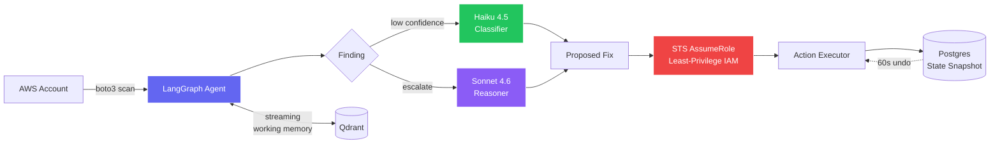
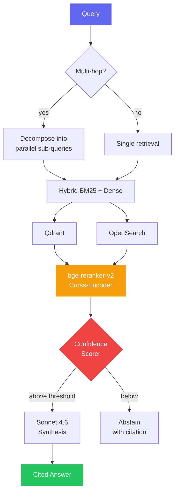

<div align="center">

<a href="https://github.com/rakulav">
  
</a>

<br/>


<br/><br/>

<a href="https://www.linkedin.com/in/rakulav-01/"></a>
<a href="mailto:rakulav26@gmail.com"></a>
<a href="https://github.com/rakulav"></a>


</div>

---

## 🧠 About Me

I'm an **AI Engineer with 5+ years** shipping generative AI and agentic systems into high-stakes financial workflows. I specialize in the unglamorous parts of LLM systems: the retrieval layer that doesn't hallucinate on policy numbers, the eval harness that catches silent regressions, the inference stack that turns a 2.1s p95 into 780ms.

- 🏦 Currently building **LangGraph agents for mortgage risk analysis** at **Fannie Mae**, running hybrid BM25 + dense retrieval over governed policy corpora
- 🔧 Previously owned **fraud detection for QuickBooks Online** at **Intuit**, serving millions of users on SageMaker
- 🎓 **M.S. Data Science**, University of Central Oklahoma (2023, 2025)
- 📜 **Oracle Cloud Infrastructure Data Science Professional** · **AWS ML Specialty**
- 🧪 Currently obsessed with: **LLM-as-judge eval harnesses, QLoRA fine-tuning under data governance, and agentic working memory patterns** that survive 5K+ item scans without blowing past 200K token budgets

```python
class Rakul:
    def __init__(self):
        self.role         = "AI Engineer"
        self.location     = "San Jose, CA"
        self.focus        = ["Agentic AI", "RAG at scale", "LLM eval & safety"]
        self.stack        = ["LangGraph", "Claude", "vLLM", "QLoRA", "AWS"]
        self.shipping     = "production LLM systems that don't hallucinate"

    def current_obsession(self):
        return "making agents reason over 5K+ items on a 200K token budget"
```

---

## 🛠️ Tech Stack

<div align="center">

**Agentic AI & Orchestration**


**LLMs, RAG & Fine-Tuning**


**Vector Stores & Search**


**Classical ML & Data**


**Cloud & MLOps**


**Languages & Storage**


</div>

---

## 🚀 Featured Projects

### 🛰️ CloudPilot — Autonomous Cloud Engineer

> **LangGraph agent with 9 AWS tools that scans, reasons about, and proposes fixes across 14 resource types. Runtime IAM synthesis with per-action least-privilege credentials, state-diff rollback engine, and a two-stage model router that cut LLM cost per scan by 78%.**



| Metric | Result |
|---|---|
| 💰 Inference cost per scan | **$0.41 → $0.09** (78% reduction) |
| 📊 Scale tested | **5K+ resources/scan**, 200K token budget |
| 🎯 Label agreement vs Sonnet-only baseline | **94%** on 200-scan eval |
| ⏪ Rollback window | **60s undo** on reversible actions |

**Tech:** `LangGraph` · `Claude Haiku 4.5 + Sonnet 4.6 (MCP)` · `AWS boto3` · `Qdrant` · `FastAPI` · `PostgreSQL` · `Next.js`

---

### 📚 PaperMind — Personal AI Research Analyst

> **Hybrid retrieval over 340 ML papers with GROBID structural parsing, a two-stage confidence scorer that abstains on low-confidence answers, and a LangGraph multi-hop controller that decomposes comparative queries into parallel sub-queries.**



| Metric | Result |
|---|---|
| 🎯 Top-5 retrieval precision | **67% → 89%** (150-query labeled eval) |
| 🚫 Hallucinations on out-of-library queries | **−74%** (300-query adversarial set) |
| 🔗 Multi-hop accuracy | **82% vs 34% baseline** (75-query 2-hop set) |
| ✅ In-scope answer rate | **91%** |

**Tech:** `Claude Sonnet 4.6` · `sentence-transformers` · `bge-reranker-v2-m3` · `Qdrant` · `OpenSearch` · `GROBID` · `LangGraph` · `FastAPI` · `Next.js`

---

### 🏦 Mortgage Risk Agent (Fannie Mae, Production)

> **LangGraph agent chaining document retrieval, policy lookup, and decision tools in a single reasoning loop over governed policy corpora. Fine-tuned a domain-adapted open-weights LLM with QLoRA under strict data governance and deployed behind vLLM on EKS.**

| Metric | Result |
|---|---|
| 📉 Hallucinations on policy numbers | **−52%** (500-question compliance eval) |
| ⚡ p95 inference latency | **2.1s → 780ms** on risk-review endpoint |
| 📄 Scale | **10M+ monthly document records** |
| 🧪 Silent regressions caught pre-prod | **4 across 2 release cycles** |
| 🔧 QLoRA fine-tuning GPU hours | **−60%** vs full fine-tuning |
| 👥 Manual analyst review | **−30%** |

**Tech:** `LangGraph` · `QLoRA` · `vLLM` · `OpenSearch (BM25 + dense)` · `AWS SageMaker` · `EKS` · `LLM-as-judge eval harness`

---

## 💼 Experience

<table>
<tr>
<td width="50%" valign="top">

### 🏦 Fannie Mae
**AI Engineer** · Jan 2025 – Dec 2025

- Architected a **LangGraph agent** for mortgage risk analysis processing thousands of documents daily
- Designed **hybrid BM25 + dense retrieval** fixing policy-number hallucinations, **+52% factuality**
- Fine-tuned a domain-adapted open-weights LLM with **QLoRA** under strict data governance
- Deployed **vLLM on EKS**, dropping p95 from **2.1s → 780ms**
- Built **LLM-as-judge eval harness** with 200-prompt regression suite gating every rollout

</td>
<td width="50%" valign="top">

### 💰 Intuit
**Machine Learning Engineer** · Aug 2021 – Jul 2023

- Owned the **fraud detection pipeline for QuickBooks Online** on SageMaker
- Trained XGBoost on **400+ behavioral features**, **+18% precision at fixed recall**
- Re-architected feature computation in PySpark on EMR: **6h → 90min**
- Built causal inference + uplift modeling pipelines (**+15% campaign efficiency**)
- Designed staged release framework with shadow, canary, and auto-rollback (**−25% incidents**)

</td>
</tr>
<tr>
<td width="50%" valign="top">

### 🖼️ GrayRadiant Data Services
**Software Engineer, ML** · Apr 2019 – Aug 2021

- Built visual search and recommendation pipelines (PyTorch ResNet), **+15% CTR**
- Deployed real-time image classification behind FastAPI
- PySpark pipelines on EMR, **−25% feature compute time**
- Schema validation and anomaly detection, **−60% corrupted data incidents**

</td>
<td width="50%" valign="top">

### 🎓 University of Central Oklahoma
**M.S. Data Science** · Aug 2023 – Jul 2025

- Focus: Agentic systems, retrieval, LLM evaluation
- **Oracle Cloud Infrastructure Data Science Professional (2025)**
- **AWS Machine Learning Specialty**

</td>
</tr>
</table>

---

## 📊 GitHub Analytics

<div align="center">


<br/>


<br/><br/>


<br/>


</div>

---

## 📫 Let's Connect

<div align="center">

I'm always up for conversations about **agentic systems, RAG at scale, LLM evaluation, and production inference**. If you're building something in this space or hiring, reach out.

<a href="https://www.linkedin.com/in/rakulav-01/"></a>
<a href="mailto:rakulav26@gmail.com"></a>
<a href="tel:+14052302654"></a>

<br/><br/>

<em>"Production LLM systems are 10% prompting and 90% retrieval, evaluation, and knowing when to abstain."</em>

</div>
